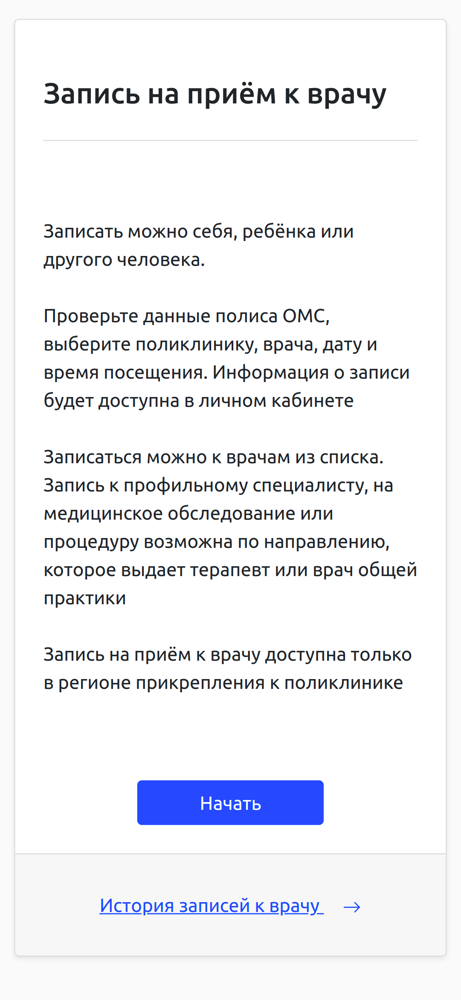
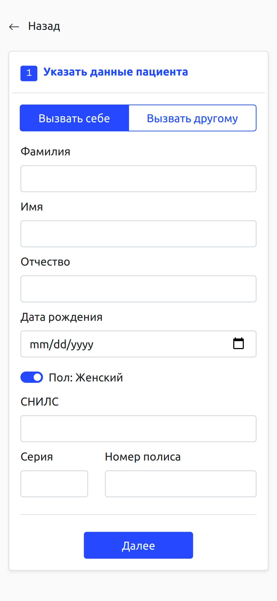
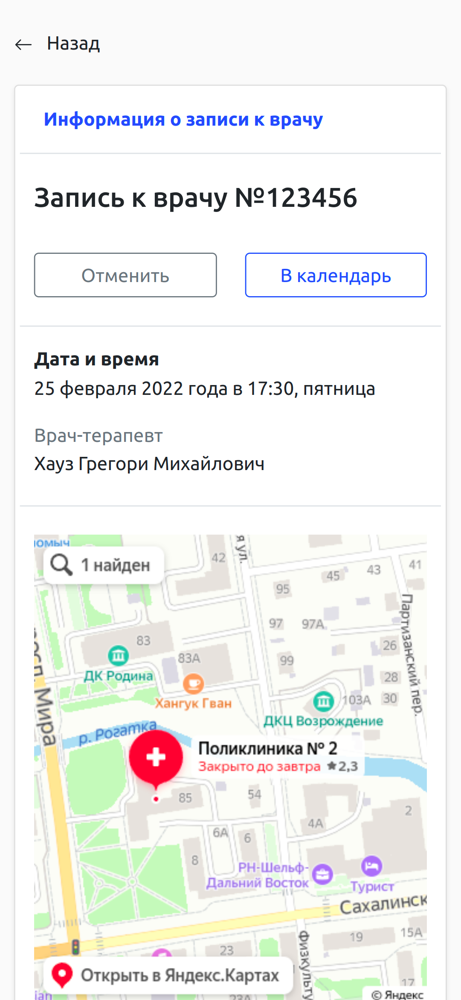

# Описание
Проект написан в рамках участия в хакатоне ["Острова.65"](https://ostrova65.sakhalin.gov.ru/). 

Цель проекта разработка mini-app для мобильной платформы "Острова.65". Разработанное решение состоит из двух частей:
1. Протип мобильного приложения (Vue.js, Bootstrap). 
2. Эмулятор работы SOAP сервиса "Запись на прием к врачу" по протоколу КУ ФЕР 3.0.0. Написан на Go.

Для запуска приложения необходимо скомпилировать ```main.go``` и запустить сервер ```FER_PORT=3001 ./main```. При переходе по URL ```http//:localhost:3001/``` открывается интерфейс мобильного приложения. По адресу ```http://localhost:3001/fer``` обрабатывает запросы SOAP сервис.

В рамках проекта сделаны автотесты UI на cypress.io ([Репозиторий](https://github.com/zibloidix/vvd_fer_golang_testing))


# Скриншоты приложения


